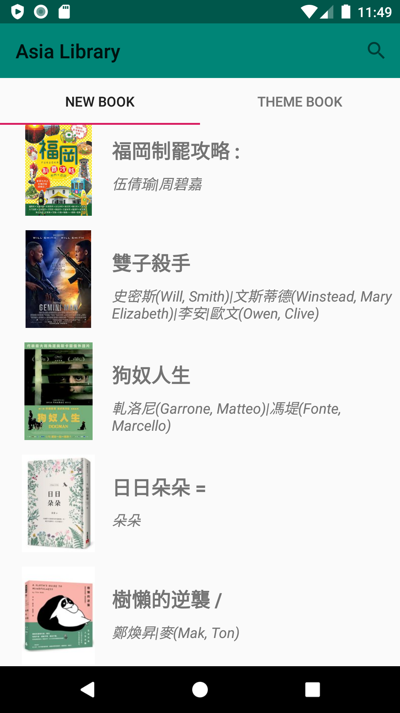
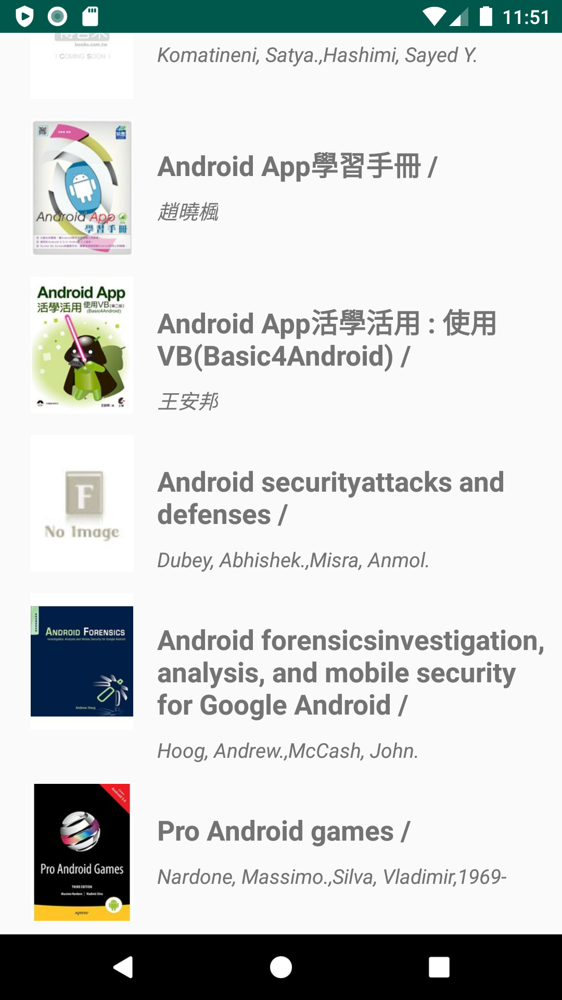

# Asia University Library Book Search App

Android APP 程式設計 期末作業。

## Requirements

- python version: 3.7.3^
- android SDK minimal version : Android 5.1 (API level 22)

## Installation

```
// Clone this repository
git clone https://github.com/yolong-lin/aulib-book-search.git

pip install -r server/requirements.txt
```

## Usage

1. 啟動 python server.

   ```
   python server/app.py
   ```

2. 執行 android app.

## Demo



